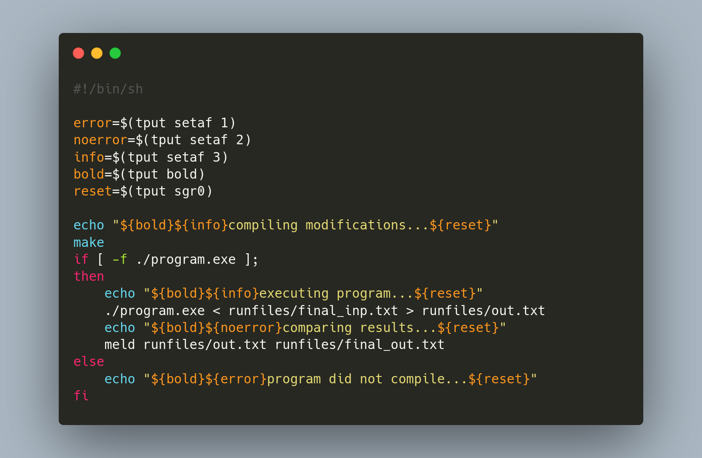
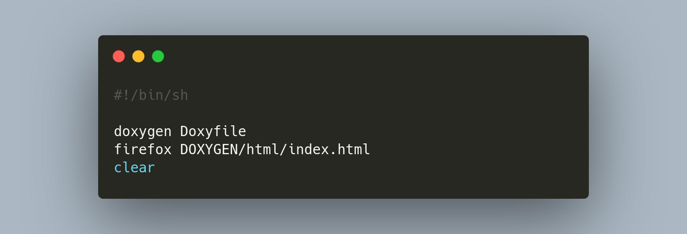

# 🎾 PRO2 - Circuito Tenis 🎾

**Explicación del Proyecto**

* [Instalación](#instalacion)
* [Ejecución](#ejecucion)
* [Doxygen](#doxygen)
* [Modificar Proyecto](#modificar)
* [Licencia](#licencia)


<a id="instalacion"></a>

## Instalación
1. Clonar el repositorio en tu ordenador:
```sh
git clone https://github.com/Morsoth119/PRO2_Circuito-Tenis.git
```

<a id="ejecucion"></a>

## Ejecución
1. Instalar **meld**:
```sh
sudo apt install meld
```
2. Ejecutar el archivo [run](run):
```sh
./run
```

<a id="doxygen"></a>

## Doxygen
1. Crear una carpeta con nombre `DOXYGEN`:
```sh
mkdir DOXYGEN
```
2. Ejecutar el archivo [dg](dg):
```sh
./dg
```

<a id="modificar"></a>

## Modificar Proyecto





<a id="licencia"></a>

## Licencia

