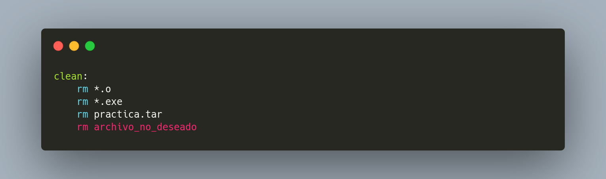
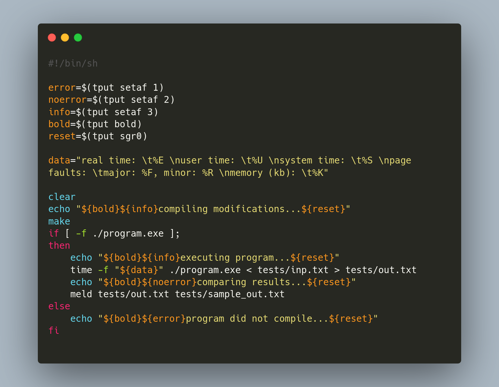

# 🎾 PRO2 - Circuito Tenis 🎾 

**Explicación del Proyecto**

* [Instalación](#instalacion)
* [Ejecución](#ejecucion)
* [Doxygen](#doxygen)
* [Crear practica.tar](#practica-tar)
* [Eliminar ejecutables](#clean)
* [Modificar proyecto](#modificar)
    * [Modificar Makefile](#modificar-makefile)
    * [Modificar entrada y salida](#modificar-io)
    * [Modificar Doxyfile](#modificar-doxyfile)
    * [Modificar Práctica](#modificar-prac)
* [Licencia](#licencia)


<a id="instalacion"></a>

## Instalación
1. Clonar el repositorio en tu ordenador:
```sh
git clone https://github.com/Morsoth119/PRO2_Circuito-Tenis.git
```

<a id="ejecucion"></a>

## Ejecución
1. Instalar **make**:
```sh
sudo apt install make
```
2. Instalar **meld**:
```sh
sudo apt install meld
```
3. Ejecutar el archivo [run](run):
```sh
./run
```

<a id="doxygen"></a>

## Doxygen
1. Instalar **doxygen**:
```sh
sudo apt install doxygen
```
2. Crear una carpeta con nombre `DOXYGEN`:
```sh
mkdir DOXYGEN
```
3. Ejecutar el archivo [dg](dg):
```sh
./dg
```

<a id="practica-tar"></a>

## Crear practica.tar
1. Tener instalado **make**.
2. Ejecutar la función:
```sh
make practica.tar
```

<a id="clean"></a>

## Eliminar ejecutables
1. Tener instalado **make**.
2. Ejecutar la función:
```sh
make clean
```

<a id="modificar"></a>

## Modificar proyecto

<a id="modificar-makefile"></a>

#### Modificar el archivo [Makefile](Makefile):

Este archivo nos automatiza tareas en las que se ven envueltos varios archivos.
* En caso de necesitar un nuevo archivo para compilar simplemente habrá que añadir estas lineas de código al archivo [Makefile](Makefile) ya existente:

 

* Además habrá que añadir los nuevos archivos al "practica.tar":


* También podremos modificar nuestra función "clean" para que elimine otros archivos no deseados:



<a id="modificar-io"></a>

#### Modificar los archivos [run](run), [inp.txt](tests/inp.txt) y [sample_out.txt](tests/sample_out.txt):

Estos archivos se encargan de automatizar la tarea de introducir la entrada y comparar la salida del programa.

* En el caso de necesitar modificar la entrada, simplemente deberemos modificar el archivo [inp.txt](tests/inp.txt).

* En el caso de necesitar comparar nuestra salida con otro archivo, tendremos que sustituir el contenido del archivo [sample_out.txt](tests/sample_out.txt) con el deseado.

* En el caso del archivo [run](run), no recomiendo modificarlo.



<a id="modificar-doxyfile"></a>

#### Modificar el archivo [dg](dg) y el [Doxyfile](Doxtfile):

Doxygen es una herramienta web para visualizar de forma clara la estructura de un programa modular.

* En el caso de querer modificar el archivo [Doxyfile](Doxtfile), dentro de este se encuentra una breve explicación de lo que hace cada opción, por lo que sólo has de ir leyendo y modificando a tu gusto.
* También existe la opción de crear un archivo Doxyfile totalmente nuevo. Para ello primero deberemos eliminar el ya existente:
```sh
sudo rm Doxyfile
```
* Y a continuación escribir:
```sh
doxygen -g
```

* En el caso del archivo [dg](dg), sólo recomiendo modificar el navegador con el que se abre la documentación creada. En mi caso utilizo Firefox.


<a id="modificar-prac"></a>

#### Modificar los archivos de la práctica:

Estos són todos lo archivos que yo he usado para la práctica (todos escritos por mi excepto [BinTree.hh](BinTree.hh)).

* [program.cc](program.cc)
* [Circuito.hh](Circuito.hh)
* [Circuito.cc](Circuito.cc)
* [Torneo.hh](Torneo.hh)
* [Torneo.cc](Torneo.cc)
* [Categoria.hh](Categoria.hh)
* [Categoria.cc](Categoria.cc)
* [Cjn_Jugadores.hh](Cjn_Jugadores.hh)
* [Cjn_Jugadores.cc](Cjn_Jugadores.cc)
* [Jugador.hh](Jugador.hh)
* [Jugador.cc](Jugador.cc)
* [BinTree.hh](BinTree.hh) _(recomiendo no modificarlo)_

<a id="licencia"></a>

## Licencia

